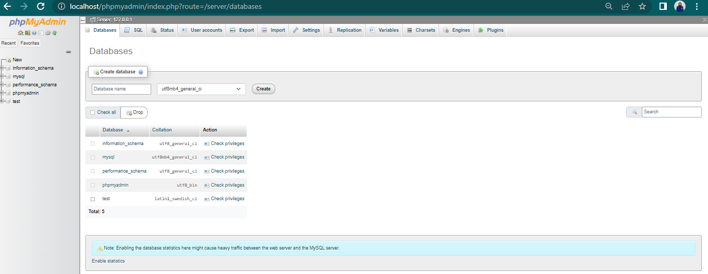

# Lab8web
untuk memenuhi tugas pemogramman web

Nama : Antini permatasari<br>
NIM  : 312010095<br>
Kelas: TI.20.B.1<br>

## PHP dan Database MySQl
<hr>
SOAL PRATIKUM<br>

)<br>
Disini saya akan mengerjakan tugas untuk memahami dan membuat program CRUD menggunakan PHP.<br>

## 1. Menjalankan Server
Untuk menjalankan server MySQL server, buka aplikasi XAMPP lalu start Apache dan MySQL. <br>
.<br>

## 2. Membuat Database
Selanjutnya saya akan membuat database dengan nama latihan1.<br>
<br>

lalu saya membuat tabel dengan cara masuk ke database latihan1 dan ke sub menu SQL.<br>
<br>
Berikut dibawah ini syntaxnya :<br>
```
CREATE TABLE data_barang ( 
    id_barang int(10) auto_increment Primary Key, 
    kategori varchar(30), 
    nama varchar(30), 
    gambar varchar(100), 
    harga_beli decimal(10,0), 
    harga_jual decimal(10,0), 
    stok int(4) 
);    
```
Bila sukses akan seperti ini hasilnya :<br>
<br>

## 3. Menambahkan Data
Selanjutnya membuat tabel, saya akan menambahkan data. Masih dengan cara yang tadi ke Sub Menu SQL,sebagai Berikut ini syntaxnya:<br>
```
INSERT INTO data_barang (kategori, nama, gambar, harga_beli, harga_jual, stok) 
VALUES ('Elektronik', 'HP Samsung Android', 'hp_samsung.jpg', 2000000, 2400000, 5), 
('Elektronik', 'HP Xiaomi Android', 'hp_xiaomi.jpg', 1000000, 1400000, 5), 
('Elektronik', 'HP OPPO Android', 'hp_oppo.jpg', 1800000, 2300000, 5);
```
<br>
setelah Sukses maka seperti berikut ini :<br>
<br>

## 4. Membuat Program CRUD
Selanjutnya saya akan buat folder <b>lab8_web_php</b> pada root directory.<br>
<br>

### 5. Membuat Koneksi Database
Selanjutnya kita masuk ke dalam folder tadi dan buat file baru dengan nama koneksi.php<br> 
Berikut ini syntaxnya :<br>
```
<!DOCTYPE html>
<html lang="en">
<head>
    <meta charset="UTF-8">
    <meta http-equiv="X-UA-Compatible" content="IE=edge">
    <meta name="viewport" content="width=device-width, initial-scale=1.0">
    <title>Koneksi</title>
</head>
<body>
<?php 
$host = "localhost"; 
$user = "root"; 
$pass = ""; 
$db = "latihan1"; 

$conn = mysqli_connect($host, $user, $pass, $db); 
if ($conn == false) 
{ 
    echo "Koneksi ke server gagal."; 
    die(); 
} 
else 
{ 
    echo "Koneksi berhasil"; 
}
?>
</body>
</html>
```
<br>
Dan Hasilnya Aakan seperti ini :<br>
<br>

### 6. Membuat file index untuk menampilkan data
Selanjutnya saya akan Buat file baru dengan nama index.php<br>
Berikut ini syntaxnya :<br>
```
<?php 
include("koneksi.php"); 

// query untuk menampilkan data 
$sql = 'SELECT * FROM data_barang'; 
$result = mysqli_query($conn, $sql); 
?>

<!DOCTYPE html>
<html lang="en">
<head>
    <meta charset="UTF-8">
    <meta http-equiv="X-UA-Compatible" content="IE=edge">
    <meta name="viewport" content="width=device-width, initial-scale=1.0">
    <link href="https://cdn.jsdelivr.net/npm/bootstrap@5.2.0-beta1/dist/css/bootstrap.min.css" rel="stylesheet" integrity="sha384-0evHe/X+R7YkIZDRvuzKMRqM+OrBnVFBL6DOitfPri4tjfHxaWutUpFmBp4vmVor" crossorigin="anonymous">
    <script src="https://cdn.jsdelivr.net/npm/bootstrap@5.2.0-beta1/dist/js/bootstrap.bundle.min.js" integrity="sha384-pprn3073KE6tl6bjs2QrFaJGz5/SUsLqktiwsUTF55Jfv3qYSDhgCecCxMW52nD2" crossorigin="anonymous"></script>
    <title>Index</title>
</head>
<body>
    <div class="container"> 
        <div class="row">
            <div class="col-sm12">
                <div class="text-center">
                    <h1>Data Barang</h1>
                    <hr>
                </div>
            </div>
        </div>
        <div class="row">
            <div class="col-sm-12">            
                <a href="tambah.php" style="text-decoration: none;"><button class="btn btn-primary"><i class="fa fa-plus"></i> Tambah</button></a> <br><br>
                    <table class="table table-striped table-bordered">
                        <thead class="text-center">
                            <th>Gambar</th> 
                            <th>Nama Barang</th> 
                            <th>Katagori</th> 
                            <th>Harga Jual</th> 
                            <th>Harga Beli</th> 
                            <th>Stok</th> 
                            <th>Aksi</th> 
                        </thread>
                        <tbody> 
                        <?php
                            if($result):
                                while($row = mysqli_fetch_array($result)):
                        ?>
                        <tr>
                            <td>" class="rounded mx-auto d-block"></td>
                            <td><?= $row['nama']; ?></td>
                            <td><?= $row['kategori']; ?></td>
                            <td class="text-center"><?= $row['harga_beli']; ?></td>
                            <td class="text-center"><?= $row['harga_jual']; ?></td>
                            <td class="text-center"><?= $row['stok']; ?></td>
                            <td>
                                <a href="ubah.php?id=<?= $row['id_barang'];?>">Ubah</a>
                                <a href="hapus.php?id=<?= $row['id_barang'];?>">Hapus</a>
                            </td>
                        </tr>
                            <?php endwhile; else: ?>
                            <tr>
                                <td colspan="7">Tidak ada data</td>
                            </tr>
                            <?php endif; ?>
                        </tbody>
                    </table>
            </div>
        </div>
    </div>
</body>
</html>
```
Disini saya akan  menggunakan bootstrap, dan kita lihat hasilnya sebagai berikut:<br>
<br>

### 7. Menambahkan Data (Create)
Selanjutnya saya akan  mencoba menambahkan data, dan saya akan membuat file baru yaitu tambah.php dengan  syntax dibawah ini :<br>
```
<?php 
error_reporting(E_ALL); 
include_once 'koneksi.php'; 

if (isset($_POST['submit'])) 
{ 
    $nama = $_POST['nama']; 
    $kategori = $_POST['kategori']; 
    $harga_jual = $_POST['harga_jual']; 
    $harga_beli = $_POST['harga_beli']; 
    $stok = $_POST['stok']; 
    $file_gambar = $_FILES['file_gambar']; 
    $gambar = null; 
    if ($file_gambar['error'] == 0) 
    { 
        $filename = str_replace(' ', '_',$file_gambar['name']); 
        $destination = dirname(__FILE__) .'/gambar/' . $filename; 
        if(move_uploaded_file($file_gambar['tmp_name'], $destination)) 
        { 
            $gambar = 'gambar/' . $filename;; 
        } 
    } 
    $sql = 'INSERT INTO data_barang (nama, kategori,harga_jual, harga_beli, stok, gambar) '; 
    $sql .= "VALUE ('{$nama}', '{$kategori}','{$harga_jual}', '{$harga_beli}', '{$stok}', '{$gambar}')"; 
    $result = mysqli_query($conn, $sql); 
    header('location: index.php'); 
}

?> 
<!DOCTYPE html> 
<html lang="en"> 
    <head> <meta charset="UTF-8"> 
    <link rel="stylesheet" href="https://cdn.jsdelivr.net/npm/bootstrap@4.3.1/dist/css/bootstrap.min.css" integrity="sha384-ggOyR0iXCbMQv3Xipma34MD+dH/1fQ784/j6cY/iJTQUOhcWr7x9JvoRxT2MZw1T" crossorigin="anonymous">
    <link rel="stylesheet" href="https://cdnjs.cloudflare.com/ajax/libs/font-awesome/6.1.1/css/all.min.css" integrity="sha512-KfkfwYDsLkIlwQp6LFnl8zNdLGxu9YAA1QvwINks4PhcElQSvqcyVLLD9aMhXd13uQjoXtEKNosOWaZqXgel0g==" crossorigin="anonymous" referrerpolicy="no-referrer" />

    <title>Menambah Data Barang</title> 
    </head>
<body>

<div class="container">
    <div class="row">
        <div class="col-sm-12">
            <div class="text-center">
                <h1>Tambah Data Barang</h1>
                <hr>
            </div>
        </div>
    </div>
    <form method="post" action="" enctype="multipart/form-data">
    <div class="col-sm-12">
        <div class="mb-3 row">
            <label for="nama" class="col-sm-2 col-form-label">Nama Barang</label>
            <div class="col-sm-7">
                <input type="text" name="nama" class="form-control" id="nama">
            </div>
        </div>
        <div class="mb-3 row">
            <label for="kategori" class="col-sm-2 col-form-label">Kategori Barang</label>
            <div class="col-sm-7">
                <select name="kategori" class="form-control form-select">
                    <option value="Komputer">Komputer</option>
                    <option value="Elektronik">Elektronik</option>
                    <option value="Handphone">Handphone</option>
                </select>
            </div>
        </div>
        <div class="mb-3 row">
            <label for="hargabeli" class="col-sm-2 col-form-label">Harga Beli</label>
            <div class="col-sm-7">
                <input type="text" name="harga_beli" id="hargabeli" class="form-control">
            </div>
        </div>
        <div class="mb-3 row">
            <label for="hargajual" class="col-sm-2 col-form-label">Harga Jual</label>
            <div class="col-sm-7">
                <input type="text" name="harga_jual" id="hargajual" class="form-control">
            </div>
        </div>
        <div class="mb-3 row">
            <label for="stok" class="col-sm-2 col-form-label">Stok</label>
            <div class="col-sm-7">
                <input type="text" name="stok" id="stok" class="form-control">
            </div>
        </div>
        <div class="mb-3 row">
            <label for="gambar" class="col-sm-2 col-form-label">Gambar</label>
            <div class="col-sm-7">
                <input type="file" name="picture" class="form-control file-upload-info" placeholder="Upload J">
            </div>
        </div>
        <div class="mb-3 row">
            <div class="col-sm-7">
                <button type="submit" name="submit" class="btn btn-primary"><i class="fa fa-save"></i> Simpan</button>
            </div>
        </div>
    </div>
    </form>
</div>
</body>
</html>
```
Dan kita lihat Hasilnya :<br>
)<br>
lalu saya akan mencoba untuk menambahkan barang.<br>
<br>
kemudian klik simpan.<br>
<br>

### 8. Mengubah Data (Remove)
Selanjutnya saya akan membuat file baru dengan nama ubah.php dengan syntax sebagai berikut :<br>
```
<?php 
error_reporting(E_ALL); 
include_once 'koneksi.php'; 

if (isset($_POST['submit']))
{
    $id = $_POST['id'];
    $nama = $_POST['nama'];
    $kategori = $_POST['kategori'];
    $harga_jual = $_POST['harga_jual'];
    $harga_beli = $_POST['harga_beli'];
    $stok = $_POST['stok'];
    $file_gambar = $_FILES['file_gambar'];
    $gambar = null;

    if ($file_gambar['error'] == 0)
    {
        $filename = str_replace(' ', '_', $file_gambar['name']);
        $destination = dirname(__FILE__) . '/gambar/' . $filename;
        if (move_uploaded_file($file_gambar['tmp_name'], $destination))
        {
            $gambar = 'gambar/' . $filename;;
        }
    }

    $sql = 'UPDATE data_barang SET ';
    $sql .= "nama = '{$nama}', kategori = '{$kategori}', ";
    $sql .= "harga_jual = '{$harga_jual}', harga_beli = '{$harga_beli}', stok = '{$stok}' ";
    if (!empty($gambar))
        $sql .= ", gambar = '{$gambar}' ";
    $sql .= "WHERE id_barang = '{$id}'";
    $result = mysqli_query($conn, $sql);

    header('location: index.php');
    }

    $id = $_GET['id'];
    $sql = "SELECT * FROM data_barang WHERE id_barang = '{$id}'";
    $result = mysqli_query($conn, $sql);
    if (!$result) die('Error: Data tidak tersedia');
    $data = mysqli_fetch_array($result);

    function is_select($var, $val) {
        if ($var == $val) return 'selected="selected"';
        return false;
}
?>

<!DOCTYPE html> 
<html lang="en"> 
    <head> <meta charset="UTF-8"> 
    <link rel="stylesheet" href="https://cdn.jsdelivr.net/npm/bootstrap@4.3.1/dist/css/bootstrap.min.css" integrity="sha384-ggOyR0iXCbMQv3Xipma34MD+dH/1fQ784/j6cY/iJTQUOhcWr7x9JvoRxT2MZw1T" crossorigin="anonymous">
    <link rel="stylesheet" href="https://cdnjs.cloudflare.com/ajax/libs/font-awesome/6.1.1/css/all.min.css" integrity="sha512-KfkfwYDsLkIlwQp6LFnl8zNdLGxu9YAA1QvwINks4PhcElQSvqcyVLLD9aMhXd13uQjoXtEKNosOWaZqXgel0g==" crossorigin="anonymous" referrerpolicy="no-referrer" />
    <title>Mengubah Data Barang</title> 
    </head>
<body>

<div class="container">
    <div class="row">
        <div class="col-sm-12">
            <div class="text-center">
                <h1>Ubah Data Barang</h1>
                <hr>
            </div>
        </div>
    </div>
    <form method="post" action="ubah.php" enctype="multipart/form-data">
    <div class="col-sm-12">
        <div class="mb-3 row">
            <label for="nama" class="col-sm-2 col-form-label">Nama Barang</label>
            <div class="col-sm-7">
                <input type="text" name="nama" class="form-control" id="nama">
            </div>
        </div>
        <div class="mb-3 row">
            <label for="kategori" class="col-sm-2 col-form-label">Kategori Barang</label>
            <div class="col-sm-7">
                <select name="kategori" class="form-control form-select">
                    <option value="Komputer">Komputer</option>
                    <option value="Elektronik">Elektronik</option>
                    <option value="Handphone">Handphone</option>
                </select>
            </div>
        </div>
        <div class="mb-3 row">
            <label for="hargabeli" class="col-sm-2 col-form-label">Harga Beli</label>
            <div class="col-sm-7">
                <input type="text" name="harga_beli" id="hargabeli" class="form-control">
            </div>
        </div>
        <div class="mb-3 row">
            <label for="hargajual" class="col-sm-2 col-form-label">Harga Jual</label>
            <div class="col-sm-7">
                <input type="text" name="harga_jual" id="hargajual" class="form-control">
            </div>
        </div>
        <div class="mb-3 row">
            <label for="stok" class="col-sm-2 col-form-label">Stok</label>
            <div class="col-sm-7">
                <input type="text" name="stok" id="stok" class="form-control">
            </div>
        </div>
        <div class="mb-3 row">
            <label for="gambar" class="col-sm-2 col-form-label">Gambar</label>
            <div class="col-sm-7">
                <input type="file" name="picture" class="form-control file-upload-info" placeholder="Upload J">
            </div>
        </div>
        <div class="mb-3 row">
            <div class="col-sm-7">
                <button type="submit" name="submit" class="btn btn-primary"><i class="fa fa-save"></i> Simpan</button>
            </div>
        </div>
    </div>
    </form>
</div>
</body>
</html>     
```
Lalu saya akan mencoba untuk merubah salah satu data yang telah ditambahkan.<br>
<br>
<br>
Kemudian saya akan merubah datanya.<br>
<br>
Datanya sudah telah berubah

### 9. Menghapus data
Selanjutnya saya akan membuat file hapus.php yang berfungsi untuk menghapus data, berikut ini syntaxnya :<br>
```
<?php 
include_once 'koneksi.php'; 
$id = $_GET['id']; 
$sql = "DELETE FROM data_barang WHERE id_barang = '{$id}'"; 
$result = mysqli_query($conn, $sql); 
header('location: index.php'); 
?>
```
Lalu Mari kita coba untuk menghapus salah satu datanya sebagai berikut,dan ini hasilnya:<br>
<br>
selanjutnya Saya akan menghapus data yang terbaru,dan ini hasilnya:<br>
<br>
Data telah terhapus........